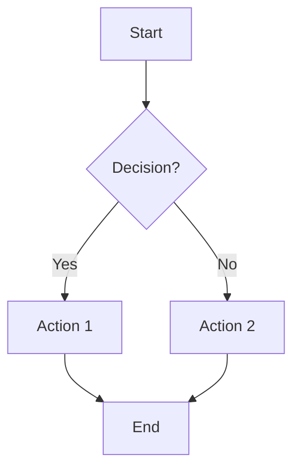
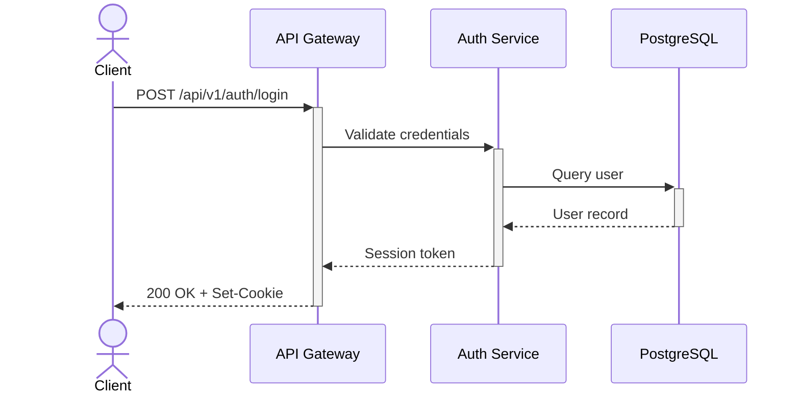
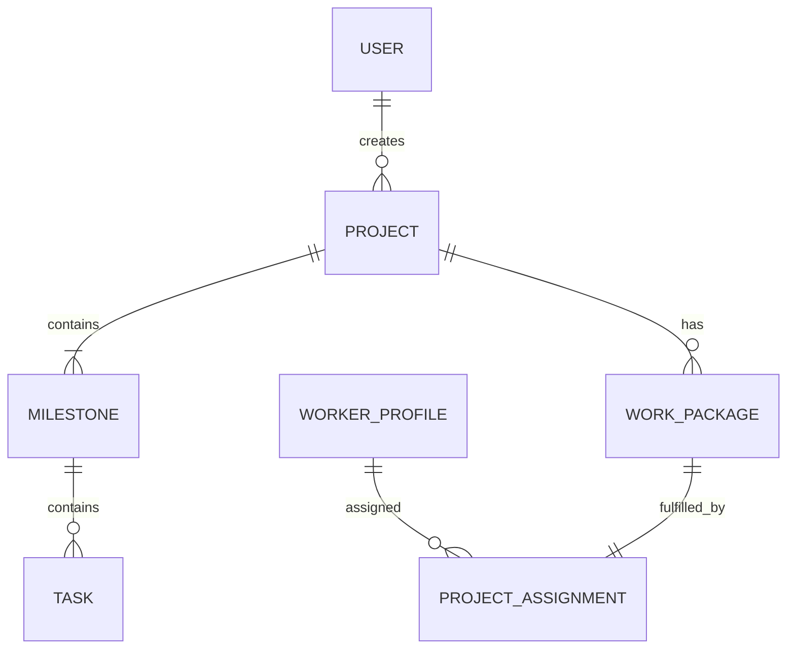
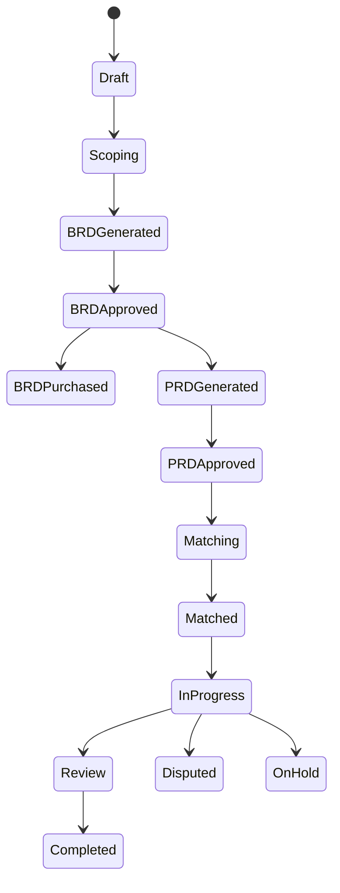
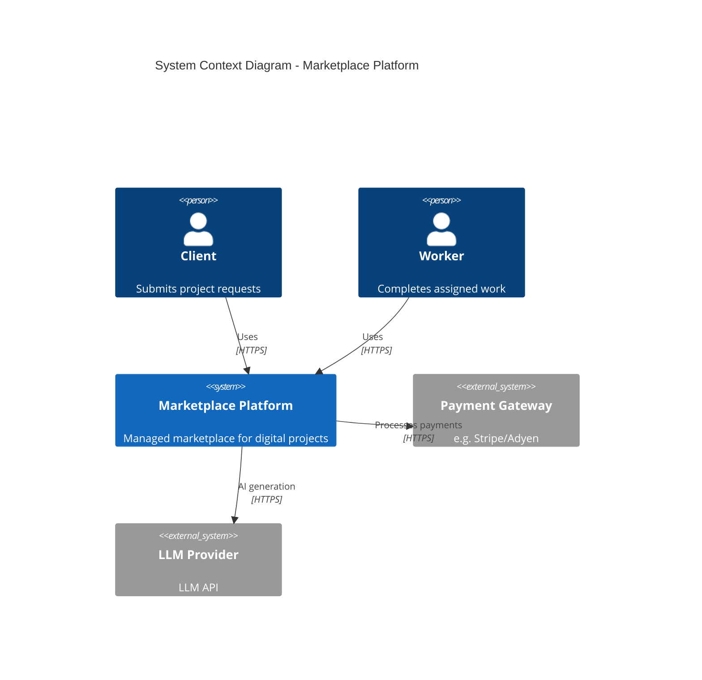
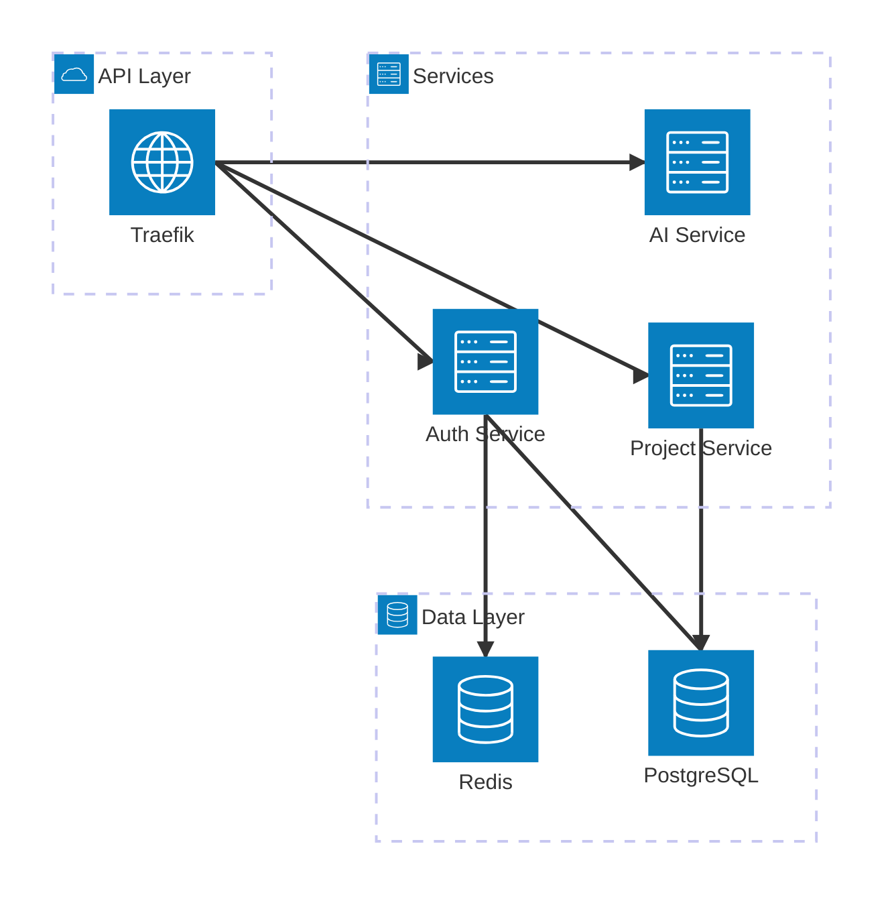
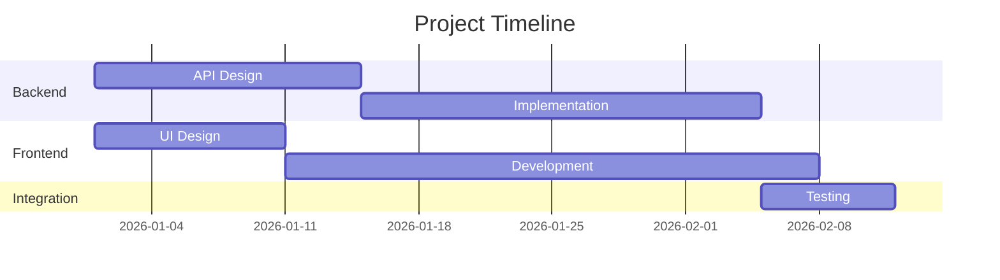

# Diagramming & Architecture Visualization

## Tool Selection Guide

| Tool | Best For | Syntax | Rendering | Ecosystem |
|---|---|---|---|---|
| **Mermaid** | Docs, GitHub, quick diagrams | Markdown-like | Browser/CLI | GitHub native, Notion, Obsidian |
| **D2** | Beautiful architecture diagrams | Declarative DSL | CLI (ELK engine) | Best aesthetics, auto-layout |
| **Structurizr DSL** | C4 model specifically | C4-specific DSL | Web/CLI | Simon Brown's official C4 tool |
| **PlantUML** | UML-heavy, most diagram types | Keyword-based | Java/Server | Most feature-rich, 15+ years |

**Default choice: Mermaid** — native in GitHub markdown, PRs, issues, docs. Use D2 when aesthetics matter. Use Structurizr for formal C4 architecture docs.

## Mermaid Syntax Reference

### Flowchart


### Sequence Diagram


### Entity Relationship Diagram


### State Diagram


### C4 Context Diagram (Mermaid C4 extension)


### Architecture Diagram


### Gantt Chart


## D2 Syntax Reference

### Architecture Diagram
```d2
direction: right

client: Client {
  shape: person
}

platform: Marketplace Platform {
  gateway: API Gateway {
    shape: hexagon
  }
  services: Microservices {
    auth: Auth Service
    project: Project Service
    ai: AI Service {
      style.fill: "#e8f0f1"
    }
    payment: Payment Service
  }
  data: Data Layer {
    pg: PostgreSQL
    redis: Redis
    nats: NATS
  }
  gateway -> services.auth
  gateway -> services.project
  gateway -> services.ai
  gateway -> services.payment
  services.auth -> data.pg
  services.project -> data.pg
  services.project -> data.nats
  services.payment -> data.pg
}

client -> platform.gateway: HTTPS

payment_gw: Payment Gateway {
  shape: cloud
}
platform.services.payment -> payment_gw: Webhooks
```

### Sequence Diagram (D2)
```d2
shape: sequence_diagram
client: Client
api: API Gateway
auth: Auth Service
db: PostgreSQL

client -> api: POST /login
api -> auth: Validate
auth -> db: Query user
db -> auth: User record
auth -> api: Session token
api -> client: 200 OK + cookie
```

## Architecture Modeling Principles

### C4 Model (Simon Brown) — 4 Levels of Abstraction

1. **Context** (Level 1): System + external actors + dependencies. Who uses it? What does it connect to?
   - Audience: everyone (business, dev, ops)
   - Shows: people, your system, external systems
   - Hides: internal details

2. **Container** (Level 2): Applications, data stores, services within the system
   - Audience: developers, architects
   - Shows: web apps, APIs, databases, message brokers, file stores
   - Hides: component-level detail

3. **Component** (Level 3): Components/modules within a container
   - Audience: developers
   - Shows: controllers, services, repositories, modules
   - Hides: code-level detail

4. **Code** (Level 4): Class/function level (usually auto-generated, rarely hand-drawn)
   - Audience: developers working on that specific code
   - Usually: IDE-generated class diagrams, only when needed

### 4+1 View Model (Philippe Kruchten, IEEE)

| View | Concerns | Diagrams | Audience |
|---|---|---|---|
| **Logical** | Functionality | Class, ER, state | Designers |
| **Process** | Concurrency, sync | Activity, sequence | Integrators |
| **Development** | Software management | Component, package | Developers |
| **Physical** | Deployment, topology | Deployment, network | DevOps |
| **+1 Scenarios** | Use cases tying all views | Use case | All stakeholders |

### Diagram Best Practices

1. **One purpose per diagram** — don't mix abstraction levels
2. **Title + legend always** — every diagram needs a title explaining what it shows
3. **Consistent notation** — same shape = same concept throughout all diagrams
4. **Max 7±2 elements** — Miller's Law applies to diagrams too
5. **Left-to-right or top-to-bottom** — follow natural reading direction
6. **Color with meaning** — color encodes information (service type, status), not decoration
7. **Version control** — diagrams-as-code live next to the code they describe
8. **Keep current** — outdated diagrams are worse than no diagrams (misleading)

### When to Use Which Diagram

| Question | Diagram Type |
|---|---|
| What does the system do? | Use case diagram |
| How do users interact step by step? | Activity diagram / flowchart |
| How do components talk to each other? | Sequence diagram |
| What's the overall system structure? | C4 Context + Container |
| What are the data entities? | ER diagram |
| What states can X be in? | State machine diagram |
| Where is it deployed? | Deployment diagram |
| What's the project timeline? | Gantt chart |
| What are the decision points? | Flowchart |

### UML Diagram Types Reference

**Structural** (static):
- Class diagram, Component diagram, Deployment diagram, Object diagram, Package diagram, Composite structure diagram

**Behavioral** (dynamic):
- Use case diagram, Activity diagram, State machine diagram, Sequence diagram, Communication diagram, Interaction overview diagram, Timing diagram

### ArchiMate Layers (Enterprise Architecture)
- **Business layer**: actors, roles, processes, services, events
- **Application layer**: components, interfaces, data objects, functions
- **Technology layer**: nodes, devices, networks, system software
